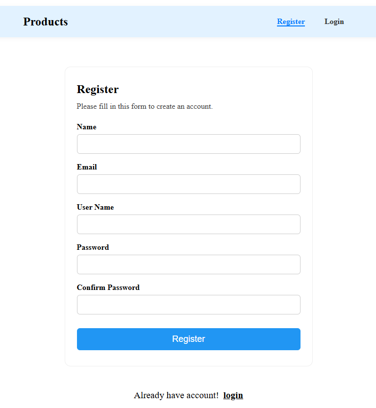

# Angular Login & Register Project

This project is a modern Angular application that demonstrates a clean, user-friendly authentication interface with the following features:

## Features

- **Angular Standalone Components**: Uses Angular's latest standalone component architecture for modularity and simplicity.
- **Responsive Navbar**: A top navigation bar with links for Login and Register, styled with SCSS and using Angular's router for navigation. The active link is automatically highlighted based on the current route.
- **Login Page**:
  - Template-driven form with real-time validation.
  - Email field: required, must match email format (regex).
  - Password field: required, must be at least 8 characters, include an uppercase letter, a number, and a special character (regex).
  - Error messages and input border colors update live based on user interaction and validation state.
  - Login button is disabled until the form is valid.
  - On successful login, the form resets to its default state.
- **Register Page**:
  - Clean, modern form layout (validation logic can be added similarly to Login).
- **SCSS Styling**:
  - All styles are written in SCSS with proper nesting and variables for maintainability.
  - Visual feedback for form validation using Angular's built-in classes (e.g., `.ng-invalid.ng-dirty`).
- **Routing**:
  - Angular Router is used for navigation between Login and Register pages.
  - Default route redirects to Login.
  - Navbar active state is always in sync with the current route.

## How It Works

- Users can navigate between Login and Register using the navbar.
- The Login form provides instant feedback and only allows submission when all fields are valid.
- After submitting, the form resets and the user can proceed as needed.

## Technologies Used

- Angular (standalone components, Angular 17+)
- Angular Router
- SCSS for styling

## Getting Started

1. Install dependencies: `npm install`
2. Start the development server: `npm start`
3. Open your browser at the provided local address to use the app.

---

This project is ideal for learning modern Angular form handling, validation, and routing best practices with a focus on clean code and user experience.

